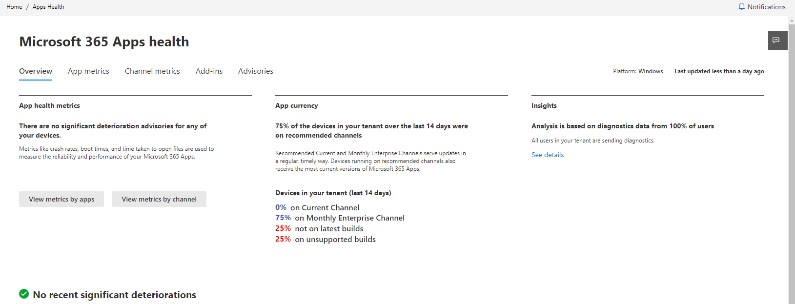

# Introduction - https://config.office.com
Create Microsoft Office installation configuration files to use with the [Office Deployment Tool](https://www.microsoft.com/en-gb/download/details.aspx?id=49117), view OneDrive service health, and define user and update preferences for your Office 365 Apps for Business or Enterprise deployments.

## Office 365 Apps

### Creating configuration XML files
When you use the [Office Deployment Tool](https://www.microsoft.com/en-gb/download/details.aspx?id=49117), you must specify a configuration file in XML format which details your selected Microsoft Office apps, version, and other settings for deployment.

Your command to use the tool might look like this:

```.\setup.exe /configure configuration.xml```

You can use the guided wizard to create a basic config that might look like this:

```xml
<Configuration ID="471eb618-a50c-4ff3-8406-5e23549a3ba8">
  <Add OfficeClientEdition="64" Channel="Current">
    <Product ID="O365BusinessRetail">
      <Language ID="MatchOS" />
      <ExcludeApp ID="Groove" />
      <ExcludeApp ID="Lync" />
    </Product>
  </Add>
  <Updates Enabled="TRUE" />
  <RemoveMSI />
  <AppSettings>
    <User Key="software\microsoft\office\16.0\excel\options" Name="defaultformat" Value="51" Type="REG_DWORD" App="excel16" Id="L_SaveExcelfilesas" />
    <User Key="software\microsoft\office\16.0\powerpoint\options" Name="defaultformat" Value="27" Type="REG_DWORD" App="ppt16" Id="L_SavePowerPointfilesas" />
    <User Key="software\microsoft\office\16.0\word\options" Name="defaultformat" Value="" Type="REG_SZ" App="word16" Id="L_SaveWordfilesas" />
  </AppSettings>
  <Display Level="None" AcceptEULA="TRUE" />
</Configuration>
```
### Managing Office updates
Using Servicing Profiles allows you to control how updates are delivered to your Office apps for all users running an instance of Office with their work credentials. 

Deploying updates via this method saves time since you are not interacting with users or their devices, but controlling the Office 365 apps policy directly. Even if an end user has installed Office on another machine using their work credentials, all applications will take policy instructions from config.office.com

>Creating a Service Profile will bring all installs of Office 365 apps in your org up to the Monthly Enterprise channel.

During the initial setup you have the freedom to select the included devices, establish rollout waves, and create a deadline for the updates - if apps miss their deadline, they will automatically close and apply updates.

### Configuring Office 365 App Policies
Remember the days of deploying Microsoft Office ADMX templates into your Group Policy environment? Oh you still do that? ... keep reading!

Similarly to how we can configure updates from config.office.com, using the Policy Managment under the Customization menu allows us to specify the end user policy preferences we'd like to use. As of writing, there are a total of 2190 policies that we can configure, ranging across all apps: Access, Word, PowerPoint, Excel etc.

Want to block all unmanaged Add-ins in Outlook? You can do this here.

## App health

### Office 365
Using the Apps health blade gives you an insight into all installed versions of Office 365 apps in your org.



While this information is interesting to review on its own, we can also use the App Metrics to get stability info about each Office 365 app, and the Add-ins tabs to help us diagnose potenential issues with compatibility between certain versions of Office 365 and 3rd-party Add-ins.


### OneDrive Sync Health
You may have noticed that there's a OneDrive setting called "Sync Admin Reports" in your Group Policy settings or Intune Configuration Profiles. 


On config.office.com you can grab your Tenant Association Key from the Setup blade which is used when applying this policy to send OneDrive sync health and status into the Microsoft 365 Apps admin center.

> You'll need to wait a while before OneDrive health data appears in this portal


Since we are heading in the direction of ensuring all our users make use of OneDrive, this is, in my view, an essential configuration option to give you more visibility of your org's configuration status and health

## Further learning
* [Microsoft Mechanics: Office and Microsoft 365 Apps Deployment & Update Management 2022
](https://youtu.be/hP9VWX8cI3Q)
* [Microsoft Docs](https://learn.microsoft.com/en-gb/deployoffice/deployment-guide-microsoft-365-apps)